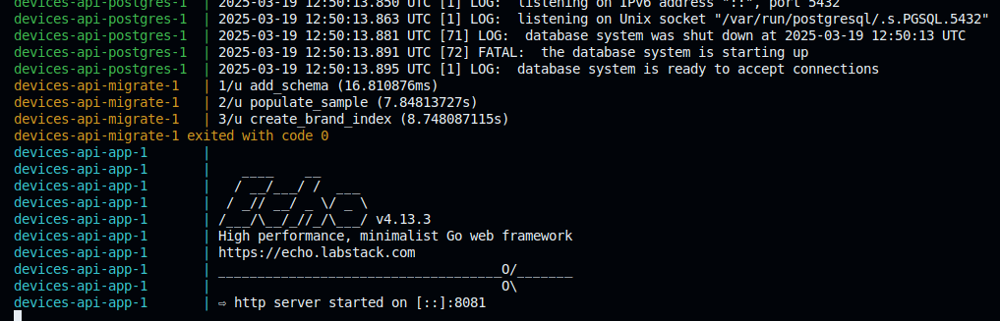
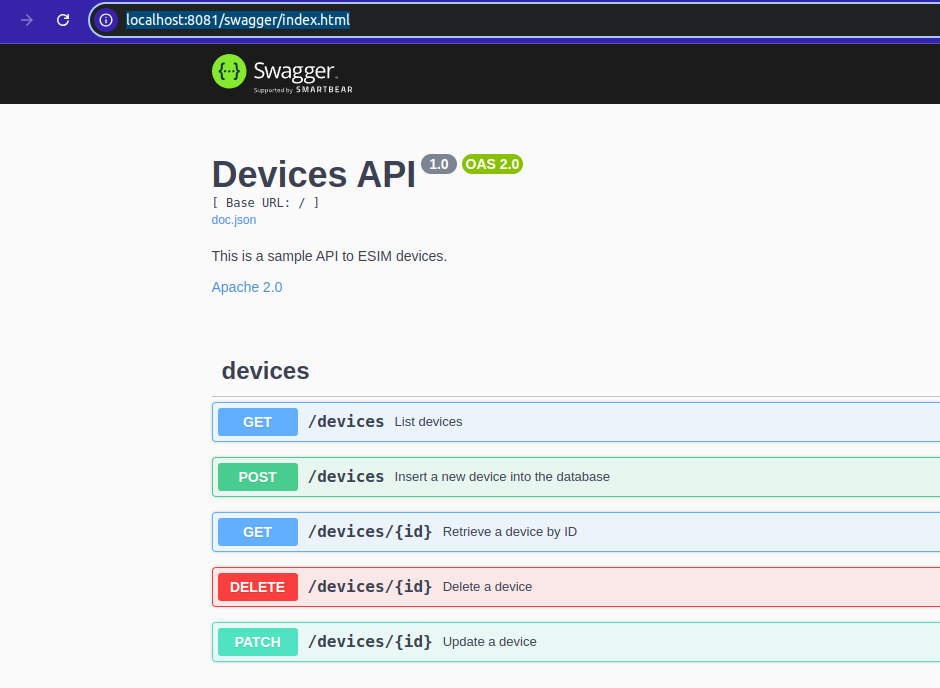

A simple API for managing devices, written in Golang, featuring CRUD endpoints and strict business rules for updating and deleting devices.


The API was tested and developmed in the following environment:

- *Docker Version:* Docker Engine - Community 20.10.22
- *Golang Version:* go1.24.0 - linux/amd64


## Setup

- To run the entire application, including the database and migrations, simply execute: `docker compose up`

You should see the output in this exact order, as the Docker Compose file defines dependencies between services. The application will only start once the database is up and migrations have successfully completed:

<h2 align="center">

</h2>


- The API is documented using Swagger and can be accessed at: http://localhost:8081/swagger/index.html

<h2 align="center">

</h2>


## Running domain tests

Domain tests were created to validate every business rule. You can find the implementations in the domain layer of the project:

- `go test ./src/domain/... -v` or `make test`


## Index Creation on Brand

The migration includes a specific step to populate the database with 1 million records. The goal is to validate the impact of creating an index for filtering queries.

Before adding the index, the PostgreSQL query planner performed a sequential scan on the table, as shown below:

```sql
EXPLAIN (ANALYZE, COSTS, VERBOSE, BUFFERS)
	SELECT * FROM devices d WHERE d.brand = 'Brand_A';

QUERY PLAN                                                                                                              |
------------------------------------------------------------------------------------------------------------------------+
Seq Scan on public.devices d  (cost=0.00..21812.04 rows=502635 width=41) (actual time=0.019..89.552 rows=499591 loops=1)|
  Output: id, name, brand, state, creation_time                                                                         |
  Filter: (d.brand = 'Brand_A'::text)                                                                                   |
  Rows Removed by Filter: 500412                                                                                        |
  Buffers: shared hit=9312                                                                                              |
Planning Time: 0.084 ms                                                                                                 |
Execution Time: 104.380 ms                                                                                              |

```

This can lead to high disk I/O and CPU usage, which negatively impacts performance in production workloads. To optimize this, we create an index:

```sql
CREATE INDEX CONCURRENTLY ON devices (brand)
```

After adding the index, the query execution time improves significantly. Additionally, the query planner now chooses a Bitmap Heap Scan, which is a more efficient way to retrieve data:

```sql
SELECT * FROM devices d WHERE d.brand = 'Brand_A';

QUERY PLAN                                                                                                                           |
-------------------------------------------------------------------------------------------------------------------------------------+
Bitmap Heap Scan on public.devices d  (cost=5603.85..21198.78 rows=502635 width=41) (actual time=10.175..56.819 rows=499591 loops=1) |
  Output: id, name, brand, state, creation_time                                                                                      |
  Recheck Cond: (d.brand = 'Brand_A'::text)                                                                                          |
  Heap Blocks: exact=9312                                                                                                            |
  Buffers: shared hit=9735                                                                                                           |
  ->  Bitmap Index Scan on devices_brand_idx  (cost=0.00..5478.19 rows=502635 width=0) (actual time=9.161..9.161 rows=499591 loops=1)|
        Index Cond: (d.brand = 'Brand_A'::text)                                                                                      |
        Buffers: shared hit=423                                                                                                      |
Planning Time: 0.078 ms                                                                                                              |
Execution Time: 70.817 ms                                                                                                            |
```

## Design Decisions

This section highlights some key architectural choices made in the project.


### Domain centric

The project follows a domain-centric approach, where a dedicated domain layer is responsible for implementing all business rules, along with their tests.

This pattern was chosen because it simplifies maintenance and testing by focusing solely on business logic. We only need to explicitly define the input and output of functions or methods. Additionally, it's crucial to avoid any I/O operations in this layer—side effects should occur at the edges of the application, such as in handlers. This leads to more maintainable and, in some cases, more efficient code.

> This is a well-known pattern. Here's a great talk on the topic: https://www.youtube.com/watch?v=P1vES9AgfC4

### sqlc

I use sqlc to generate idiomatic Go code from SQL queries. This allows me to speed up development by simply writing the queries for each use case and then calling the generated methods from the `repository` package.

- sqlc can be installed with Go: `go install github.com/sqlc-dev/sqlc/cmd/sqlc@latest`

Then, run sqlc generate to generate code from SQL queries.

### migrate

I manage database migrations using [migrate-cli](https://github.com/golang-migrate/migrate), which allows versioning of database schemas, indexes, and more using pure SQL. It supports many databases and integrates easily into containerized environments.

- Install migrate-cli with Go: `go install -tags 'postgres' github.com/golang-migrate/migrate/v4/cmd/migrate@latest`

### Echo Http Framework and API Documentation

I use the [Echo Go web framework](https://github.com/labstack/echo) to serve the HTTP API. It is lightweight, performs well in benchmarks, and is easy to use.

Additionally, Echo provides an easy-to-use tool for generating RESTful API documentation with Swagger 2.0 via the [echo-swagger middleware](https://github.com/swaggo/echo-swagger).

- To set it up: `go install github.com/swaggo/swag/cmd/swag@latest` and then to generate the docs: http://localhost:8081/swagger/index.html


## Further Possible Improvements

This section outlines potential improvements for the API. These enhancements won’t be implemented since this is a small project, but they would be nice to have if we plan to make the application production-ready:

- *Observability:* Add tracing with OpenTelemetry, a standardized way to improve observability. This is highly useful for debugging and understanding production workflows. Reference: https://opentelemetry.io/docs/languages/go/
- *Scalability and Performance:* Use k6 to run basic performance tests (https://grafana.com/docs/k6/latest/using-k6/thresholds/) and identify potential bottlenecks. Consider adding pagination to the device list endpoint or partitioning the devices table by brand_key or a future user_id, if applicable.
- *Maintenability:* Add integration tests to cover end-to-end scenarios, including side effects like HTTP requests and database interactions.
- *Continuous Integration and Deployment*: Automate tests and deployments using GitHub Actions.
